# CSS Grid Layout Module

September 2020

\> 🔨 CSS Grid. From Udemy '[Maîtrisez CSS GRID !](https://www.udemy.com/course/maitrisez-css-grid/)' and [A Complete Guide to Grid](https://css-tricks.com/snippets/css/complete-guide-grid)

\* * *

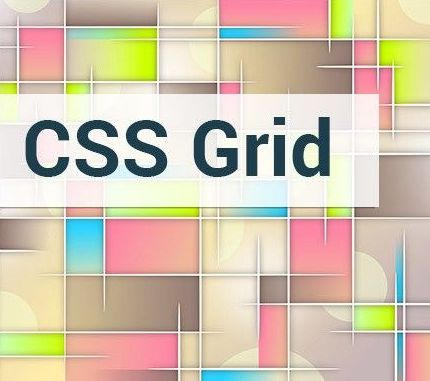


## CSS Grid

CSS Grid Layout (aka “Grid”), is a two-dimensional grid-based layout system that aims to do nothing less than completely change the way we design grid-based user interfaces. CSS has always been used to lay out our web pages, but it’s never done a very good job of it. First, we used tables, then floats, positioning and inline-block, but all of these methods were essentially hacks and left out a lot of important functionality (vertical centering, for instance). Flexbox helped out, but it’s intended for simpler one-dimensional layouts, not complex two-dimensional ones (**Flexbox and Grid actually work very well together**). Grid is the very first CSS module created specifically to solve the layout problems we’ve all been hacking our way around for as long as we’ve been making websites.

## Firefox inspector

Use Firefiox to check the layout. 

It's more efficient than ther one in Chrome.

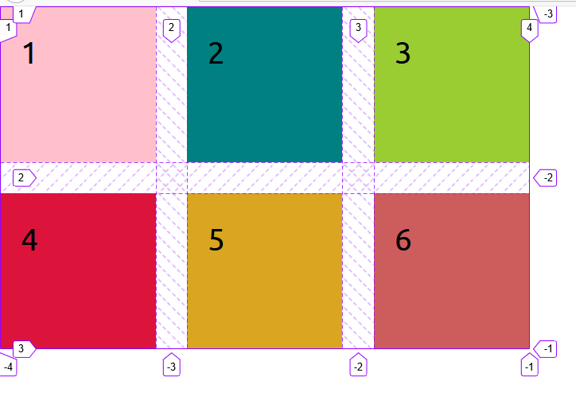

## Terminology

### Grid Container

The element on which display: grid is applied. It’s the direct parent of all the grid items. In this example container is the grid container.

````html
<div class="container">
  <div class="item item-1"> </div>
  <div class="item item-2"> </div>
  <div class="item item-3"> </div>
</div>
````

### Grid Item

The children (i.e. direct descendants) of the grid container. Here the item elements are grid items, but sub-item isn’t.

````html
<div class="container">
  <div class="item"> </div>
  <div class="item">
    <p class="sub-item"> </p>
  </div>
  <div class="item"> </div>
</div>
````

### Grid Line

The dividing lines that make up the structure of the grid. They can be either vertical (“column grid lines”) or horizontal (“row grid lines”) and reside on either side of a row or column. Here the yellow line is an example of a column grid line.

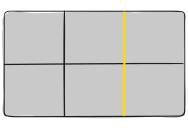


### Grid Cell

The space between two adjacent row and two adjacent column grid lines. It’s a single “unit” of the grid. Here’s the grid cell between row grid lines 1 and 2, and column grid lines 2 and 3.

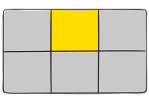

### Grid Track

The space between two adjacent grid lines. You can think of them like the columns or rows of the grid. Here’s the grid track between the second and third row grid lines.

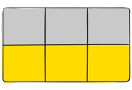


### Grid Area

The total space surrounded by four grid lines. A grid area may be composed of any number of grid cells. Here’s the grid area between row grid lines 1 and 3, and column grid lines 1 and 3.

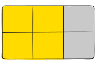

### Fractional unit

Fraction of the free space in the grid (using the fr unit).

````scss
.container{
  display: grid;
  grid-template-rows: repeat(2, 1fr);
  grid-template-columns: repeat(3, 1fr);
  grid-gap: 30px;
  margin: 25px;
  height: 1000px;
}
````

All the items will share the available space:


### Grid explicit and implicit

We can define a fixed number of lines and tracks that form a grid by using the properties grid-template-rows, grid-template-columns, and grid-template-areas. This manually defined grid is called the explicit grid.

If there are more grid items than cells in the grid or when a grid item is placed outside of the explicit grid, the grid container automatically generates grid tracks by adding grid lines to the grid. The explicit grid together with these additional implicit tracks and lines forms the so called implicit grid.

````scss
.container{
  display: grid;
  grid-template-rows: repeat(1, 150px);
  grid-template-columns: repeat(3, 150px);
  grid-gap: 30px;
  margin: 25px;
}
````


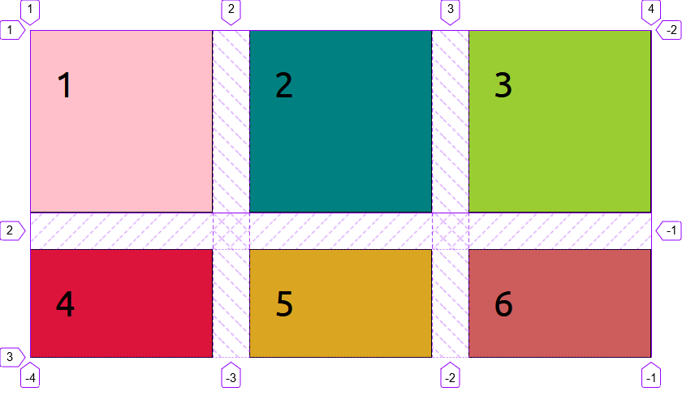


## Properties: Containers

### display

Defines the element as a grid container and establishes a new grid formatting context for its contents.

Values:

- **grid** – generates a block-level grid
- **inline-grid** – generates an inline-level grid

### grid-template-rows / grid-template-columns

Defines the columns and rows of the grid with a space-separated list of values. The values represent the track size, and the space between them represents the grid line.

````html
    <div class="container">
      <div class="items item1">1</div>
      <div class="items item2">2</div>
      <div class="items item3">3</div>
      <div class="items item4">4</div>
      <div class="items item5">5</div>
      <div class="items item6">6</div>
    </div>
````


````scss
.container{
  display: grid;
  grid-template-rows: 150px 150px;
  //or: grid-template-rows: repeat(2, 150px);
  grid-template-columns: 150px 150px 150px;
  //or: grid-template-columns: repeat(3, 150px);
  grid-gap: 30px;
  margin: 25px;
}

.items{
  padding: 20px;
  font-size: 30px;
  border: solid 1px;
}
````


 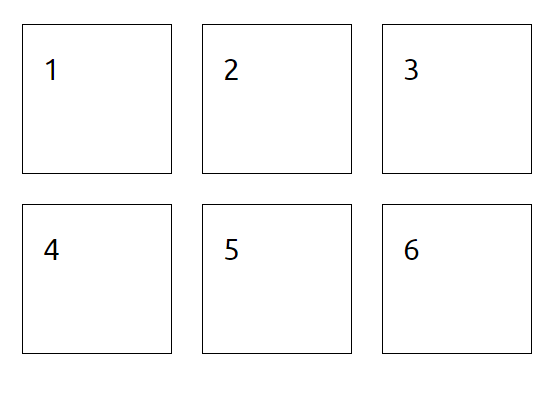

We can also define a name for start and end.

````scss
.container{
  display: grid;
  grid-template-rows: [header-start]150px[header-end]150px;
  //grid-template-rows: [row1-start] 25% [row1-end row2-start] 25% [row2-end];
  //...	
}

//...

.item6{
  grid-row: header-start / header-end;
  // grid-row: row1-start / row2-end;
  background-color: indianred;
}
````

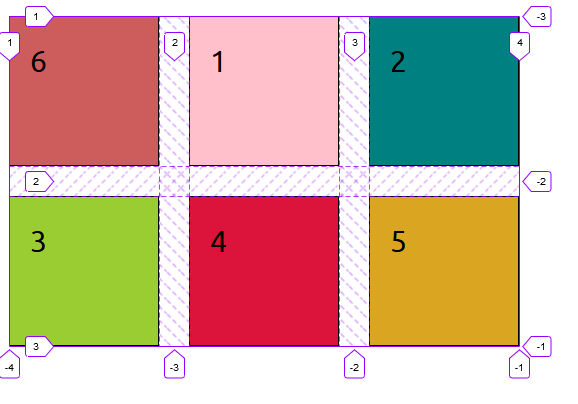


````
grid-template-columns: repeat(3, [col-start]150px[col-end]);
````

will create:

*col-start1 / col-end1*

*col-start2 / col-end2*

*col-start3 / col-end3*


### grid-template-areas

Defines a grid template by referencing the names of the grid areas which are specified with the `grid-area` property.

````scss
.container{
  display: grid;
  grid-template-rows: repeat(2, 150px);
  grid-template-columns: repeat(3, 150px);
  grid-template-areas: "header header header"
                        "footer footer footer footer";
  grid-gap: 30px;
  margin: 25px;
}

//...

.item1{
  grid-area: header;
  background-color: pink;
}
````

In that case the item1 willm take all the first row called header.

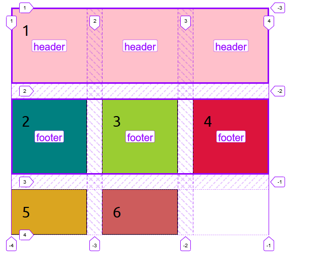

If we want that the item only takes 2 columns for instance, we can set:

````scss
  grid-template-areas: "header header ."
                        "footer footer footer footer";
````


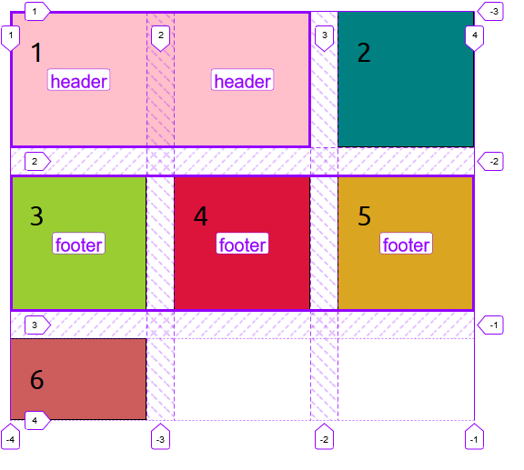

NB: it's very important not to forget to name a cell.

### grid-template

A shorthand for setting grid-template-rows, grid-template-columns, and grid-template-areas in a single declaration.

````scss
.container {
  grid-template-rows: [row1-start] 25px [row1-end row2-start] 25px [row2-end];
  grid-template-columns: auto 50px auto;
  grid-template-areas: 
    "header header header" 
    "footer footer footer";
}


````

Is the same than:

````scss
.container {
  grid-template:
    [row1-start] "header header header" 25px [row1-end]
    [row2-start] "footer footer footer" 25px [row2-end]
    / auto 50px auto;
}
````


### column-gap / row-gap / gap (old: grid-column-gap / grid-row-gap / grid-gap) 

Specifies the size of the grid lines. You can think of it like setting the width of the gutters between the columns/rows.

`gap` is a shorthand for row-gap and column-gap

````scss
.container{
  width: 1000px;
  display: grid;
  grid-template-rows: repeat(2, 150px);
  grid-template-columns: repeat(3, 150px);
  row-gap: 15px; 
  column-gap: 10px;
  //or: gap: 15px 10px;
  margin: 25px;
}
````

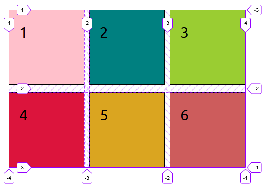


### justify-items / align-items / place-items 

By default content is streched.

`justify-item`s: centered on X axis (start / center / end)

`align-items`: centered on Y axis  (start / center / end)

````scss
.container{
  width: 1000px;
  display: grid;
  grid-template-rows: repeat(2, 150px);
  grid-template-columns: repeat(3, 150px);
  justify-items: center;
  align-items: center;
  grid-gap: 30px;
  margin: 25px;
}
````


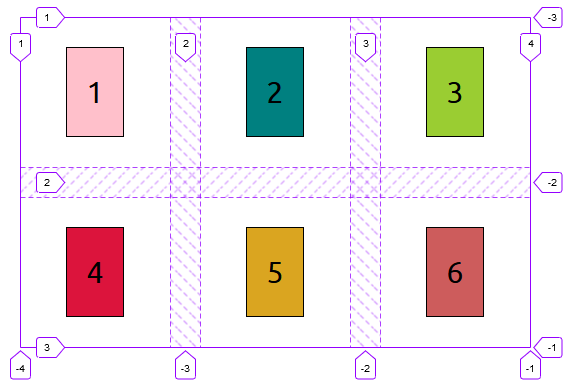


`place-item`: sets both the align-items and justify-items properties in a single declaration.

````scss
.container{
  width: 1000px;
  margin: 30px auto;
  display: grid;
  grid-template-rows: repeat(2, 150px);
  grid-template-columns: repeat(3, 150px);
  place-items: center stretch;
  grid-gap: 30px;
}
````

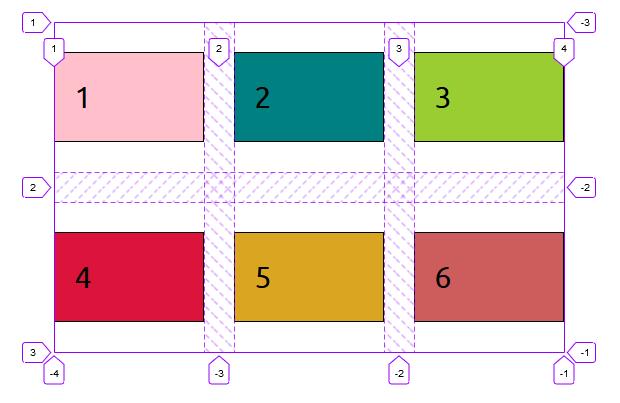


### justify-content / align-content / place-content

`justify-conten`t: you can set the alignment of the grid within the grid container. This property aligns the grid along the *inline (row)* axis (as opposed to `align-content` which aligns the grid along the *block (column)* axis).

`align-content`:  you can set the alignment of the grid within the grid container. This property aligns the grid along the *block (column)* axis (as opposed to `justify-content` which aligns the grid along the *inline (row)* axis).

````
.container{
  width: 1000px;
  margin: 30px auto;
  display: grid;
  grid-template-rows: repeat(2, 150px);
  grid-template-columns: repeat(3, 150px);
  justify-content: center;
  align-content: center;
  grid-gap: 30px;
}
````


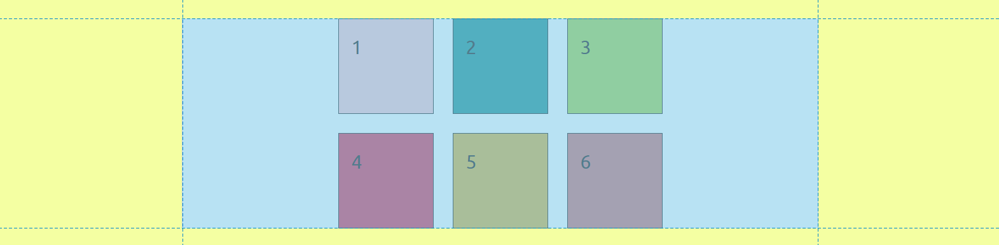

`place-content`: sets both the align-content and justify-content properties in a single declaration.

````scss
.container{
  width: 1000px;
  margin: 30px auto;
  display: grid;
  grid-template-rows: repeat(2, 150px);
  grid-template-columns: repeat(3, 150px);
  place-content: end center;
  grid-gap: 30px;
}
````

### grid-auto-columns / grid-auto-rows / grid-auto-flow

Specifies the size of any auto-generated grid tracks (aka implicit grid tracks).

````scss
.container{
  display: grid;
  //explicit
  grid-template-rows: repeat(1, 150px);
  grid-template-columns: repeat(3, 150px);
  //implicit
  grid-auto-rows: 200px;
    
  grid-gap: 30px;
  margin: 25px;
}
````


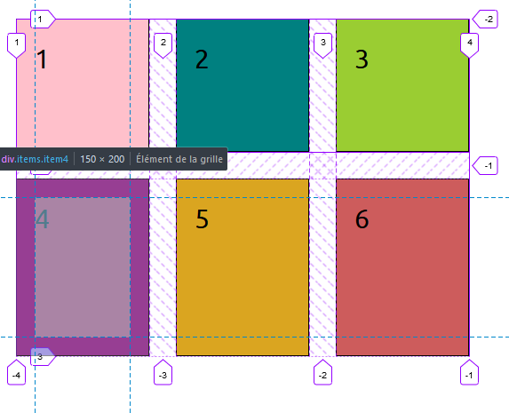

````scss
.container{
  width: 1000px;
  display: grid;
  //explicit
  grid-template-rows: repeat(1, 150px);
  grid-template-columns: repeat(3, 150px);
  //implicit
  grid-auto-flow: column;
  grid-gap: 30px;
  margin: 25px;
}
````

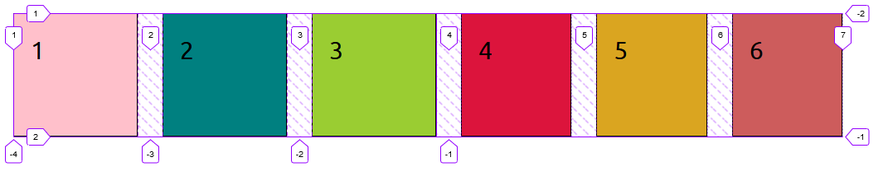

### grid

A shorthand for setting all of the following properties in a single declaration: grid-template-rows, grid-template-columns, grid-template-areas, grid-auto-rows, grid-auto-columns, and grid-auto-flow (Note: You can only specify the explicit or the implicit grid properties in a single grid declaration).

````scss
.container {
  grid: [row1-start] "header header header" 1fr [row1-end]
        [row2-start] "footer footer footer" 25px [row2-end]
        / auto 50px auto;
}
````

is equivalent to:

````scss
.container {
  grid-template-areas: 
    "header header header"
    "footer footer footer";
  grid-template-rows: [row1-start] 1fr [row1-end row2-start] 25px [row2-end];
  grid-template-columns: auto 50px auto;    
}
````

## Properties: Items

### grid-column-start / grid-row-start / grid-column-end / grid-row-end /  grid-area

Set were the selected item will start or end.


````scss
.item1{
  grid-row-start: 2;
  grid-row-end: 3;
  grid-column-start: 2;
  grid-column-end: 3;
  background-color: pink;
}

//or

.item1{
  grid-row: 2 / 3;
  // grid-row-start / grid-row-end
  grid-column: 2 / 3;
  // grid-column-start / grid-column-end
  background-color: pink;
}

//or

.item1{
  grid-area: 2 / 2 / 3 / 3;
  // grid-row-start / grid-column-start / grid-row-end / grid-column-end
}
````

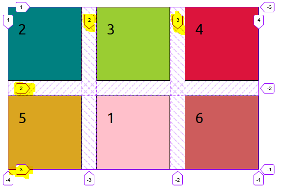

````scss
.item1{
  grid-row: 1 / 2;
  grid-column: 1 / 4;
  // "-1": means last row or column. But it will push the others items after.
  background-color: pink;
}
````

The item1 take all the columns, and push the other items. Last items are reduced to fit the remaining space.

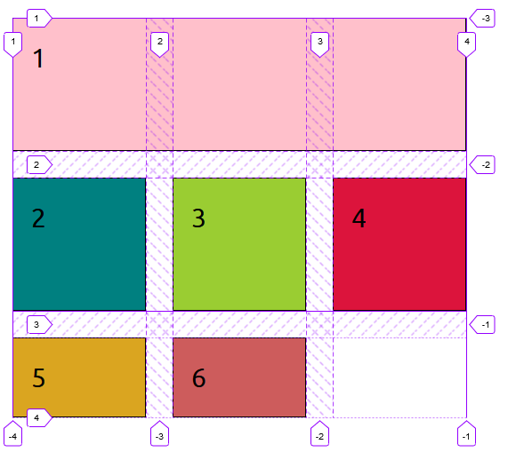

As we have seen before it's possible to refer to the names as we have seen before.:

````
.item6{
  grid-row: header-start / header-end;
  background-color: indianred;
}
````

### justify-self / align-self / place-self

`justify-self`: Aligns a grid item inside a cell along the inline (row) axis (as opposed to align-self which aligns along the block (column) axis). This value applies to a grid item inside a single cell.

`align-self:` Aligns a grid item inside a cell along the block (column) axis (as opposed to justify-self which aligns along the inline (row) axis). This value applies to the content inside a single grid item.

`place-self`: sets both the align-self and justify-self properties in a single declaration. The first value will be used for align-self and the second for justify-self. If there is no second value, the first will also be used for justify-self.

````scss
.container{
  width: 1000px;
  display: grid;
  grid-template-rows: repeat(2, 150px);
  grid-template-columns: repeat(3, 150px);
  justify-items: center;
  align-items: center;
  grid-gap: 30px;
  margin: 25px;
}

.items{
  padding: 20px;
  font-size: 30px;
  border: solid 1px;
}

.item1{
  justify-self: end;
  background-color: pink;
}

.item2{
  align-self: start;
  background-color: teal;
}

.item3{
  place-self: start end; //align-self / justify-self
  background-color: yellowgreen;
}
````

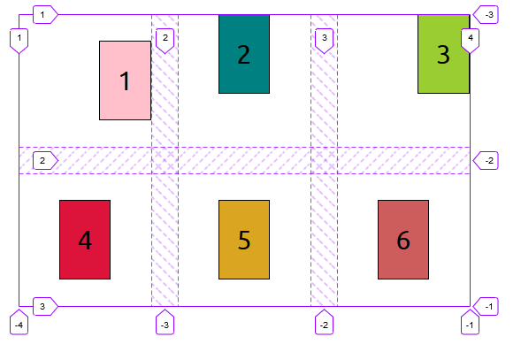

## Other properties

### min-content, max-content, auto

`max-content`:  Is a keyword representing the largest maximal content contribution of the grid items occupying the grid track.
`min-content`: Is a keyword representing the largest minimal content contribution of the grid items occupying the grid track.

````html
    <div class="container">
      <div class="items item1">1: Lorem ipsum dolor</div>
      <div class="items item2">2</div>
      <div class="items item3">3</div>
      <div class="items item4">4</div>
      <div class="items item5">5</div>
      <div class="items item6">6: Excepturi officia eligendialiquid, repellendus.</div>
    </div>
````

````scss
.container{
  width: 1000px;
  margin: 30px auto;
  display: grid;
  grid-template-rows: repeat(2, 150px);
  grid-template-columns: max-content 1fr 1fr;
  grid-gap: 30px;
}
````


## How to test

- Clone
- `npm install`
- `parcel serve index.html`
- Launch: `http://localhost:1234`


## Useful links

- [An Introduction to CSS Grid Layout (with Examples)](https://www.freecodecamp.org/news/intro-to-css-grid-layout/)
- [Getting started: CSS Grid vs Flexbox](https://medium.com/@daniaherrera/getting-started-css-grid-vs-flexbox-b3012fce6476)
- [A Complete Guide to Grid](https://css-tricks.com/snippets/css/complete-guide-grid/)
- [The Difference Between Explicit and Implicit Grids](https://css-tricks.com/difference-explicit-implicit-grids/)